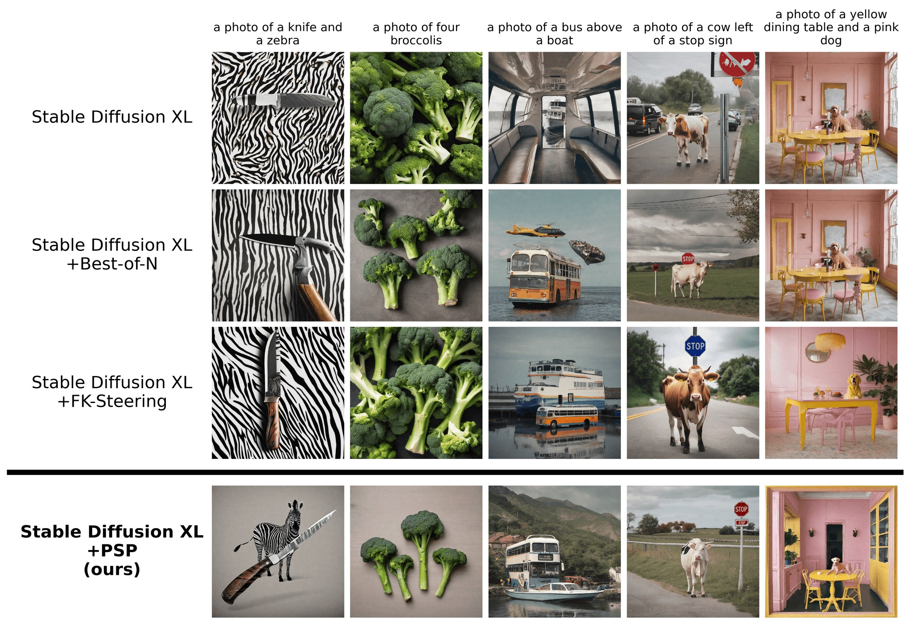
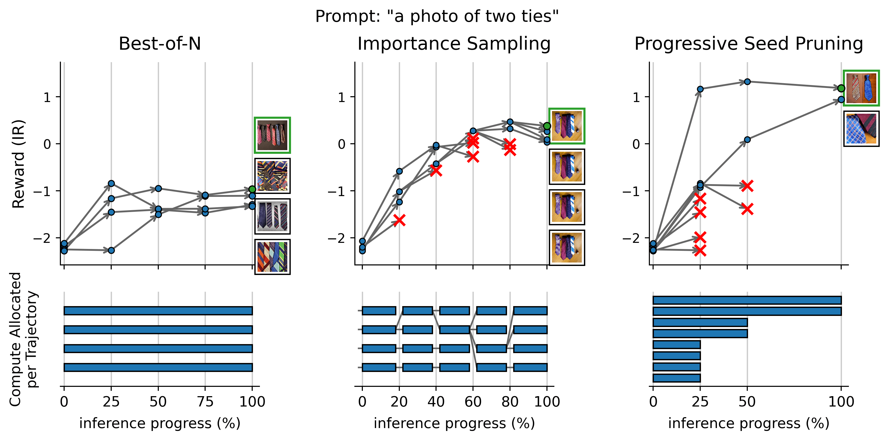
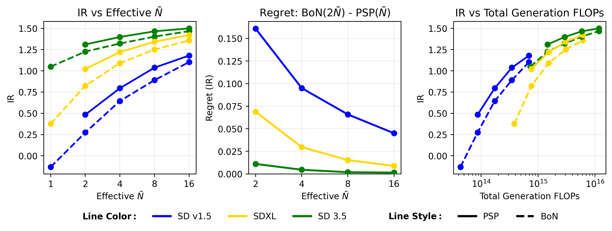
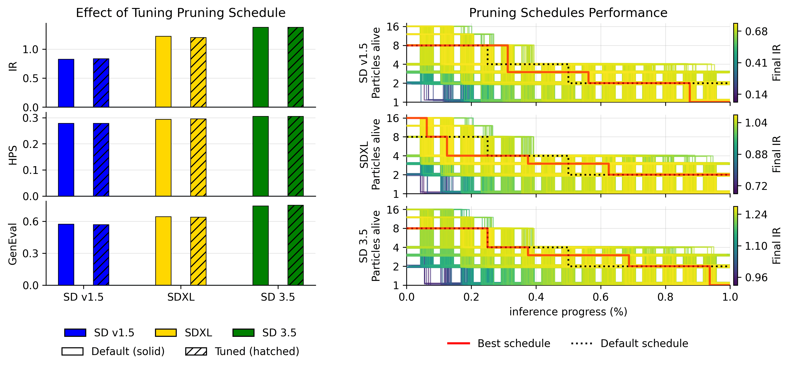
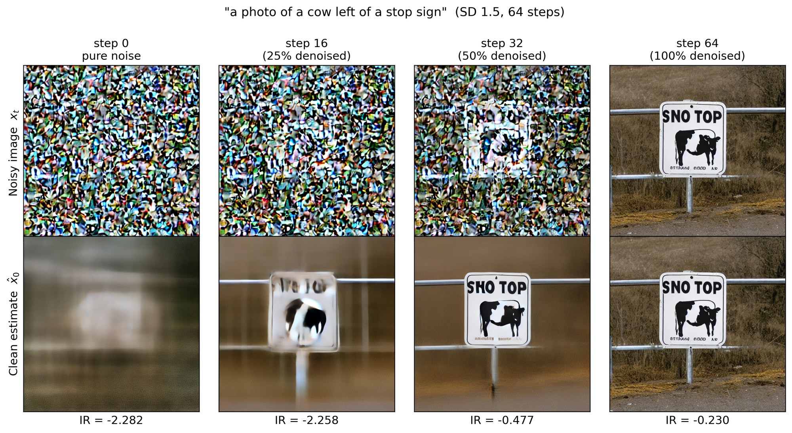
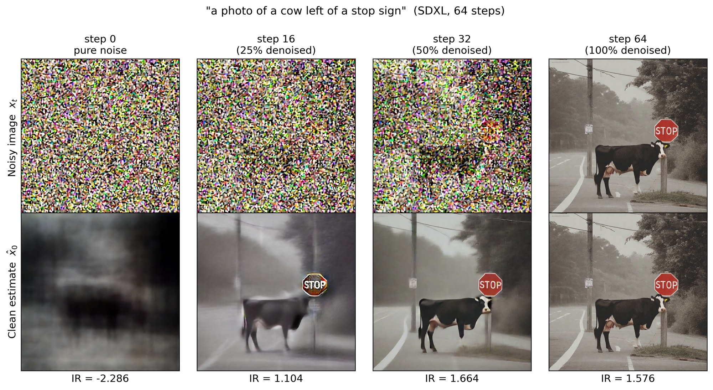
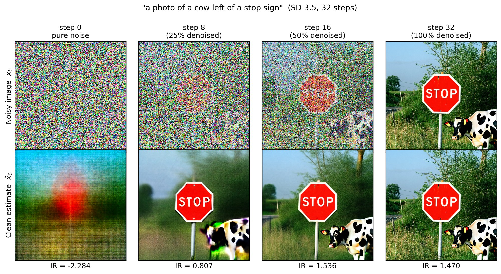

# Independent reproduction: progressive seed pruning on SD1.5

We tested the central matched-compute claim from [Inference-Time Scaling of Diffusion Models via Progressive Seed Pruning](https://arxiv.org/abs/2607.21591): score eight Stable Diffusion 1.5 seeds early, prune them 8→4→2, and compare the final result with Best-of-N=4 at the same 256 denoising-forward-pass selection budget.

**Assessment: partially reproduced.** On five fresh seed windows covering 240 paired generations from a stratified 48-prompt GenEval subset, PSP improved ImageReward by **+0.160** (paper: **+0.172**) but changed GenEval correctness by **−0.004** (paper: **+0.032**). The ImageReward interval excluded zero; the GenEval and independent CLIP intervals did not. An equal-budget early/late timing schedule more than doubled oracle regret, supporting the paper’s mechanism claim.

This is deliberately bounded: 48 of 553 GenEval prompts, five seed windows, SD1.5 only, CLIP cosine substituted for unavailable HPSv2, and GenEval’s original mmcv detector stack was replaced by the same decision rules over a public Transformers Mask2Former detector. Runs used Kubernetes on NVIDIA RTX PRO 6000 Blackwell GPUs, with 16 GPUs at peak concurrency and 0.391 hours of elapsed wall time for the fresh attempt.

[Read the illustrated report](reports/psp-sd15/report.md) · [Open the self-contained notebook](notebooks/psp_reproduction.py)

[](https://molab.marimo.io/github/alphaXiv/psp-cb6b5ed0/blob/main/notebooks/psp_reproduction.py)

## Experiment log

| Branch / experiment | Purpose or change | Exact run command | Assessment / outcome | Compute |
|---|---|---|---|---|
| `main` | Public report, notebook, figures, and runnable harness | Not run as an experiment (publication surface) | Presentation only | — |
| [Lock-safe seed window 0](https://github.com/alphaXiv/psp-cb6b5ed0/tree/orx/lock-safe-clip-and-geneval-evaluation-scout) | Paired seed pool, default and timing schedules | `bash reproduction/run.sh` | Complete; +0.172 ImageReward, +0.000 GenEval | Kubernetes, 4× RTX PRO 6000 Blackwell |
| [Final paired seed window 1](https://github.com/alphaXiv/psp-cb6b5ed0/tree/orx/final-paired-evidence-seed-window-1) | Independent seed window | `bash reproduction/run.sh` | Complete; +0.246 ImageReward, +0.000 GenEval | Kubernetes, 4× RTX PRO 6000 Blackwell |
| [Final evidence seed window 2](https://github.com/alphaXiv/psp-cb6b5ed0/tree/orx/final-evidence-psp-seed-window-2) | Independent seed window | `bash reproduction/run.sh` | Complete; +0.182 ImageReward, +0.083 GenEval | Kubernetes, 4× RTX PRO 6000 Blackwell |
| [Lock-safe seed window 3](https://github.com/alphaXiv/psp-cb6b5ed0/tree/orx/lock-safe-final-evidence-seed-window-3) | Independent seed window and negative-variance check | `bash reproduction/run.sh` | Complete; +0.023 ImageReward, −0.021 GenEval | Kubernetes, 4× RTX PRO 6000 Blackwell |
| [Lock-safe seed window 4](https://github.com/alphaXiv/psp-cb6b5ed0/tree/orx/lock-safe-final-evidence-seed-window-4) | Fifth independent seed window | `bash reproduction/run.sh` | Complete; +0.177 ImageReward, −0.083 GenEval | Kubernetes, 4× RTX PRO 6000 Blackwell |

The exact aggregate, confidence intervals, detector substitution, and run identifiers are preserved in [`results/reproduction_summary.json`](results/reproduction_summary.json). Early recovery branches that stopped before evaluation are omitted from the table; their logs identify dependency and concurrent-cache failures, not measurements.

---

# PSP: Inference-Time Scaling of Diffusion Models via Progressive Seed Pruning

[](https://arxiv.org/abs/2607.21591)
[](LICENSE)

Official implementation of the paper Inference-Time Scaling of Diffusion Models via Progressive Seed Pruning (ECCV 2026)

**Rogério Guimarães, Pietro Perona** &middot; California Institute of Technology

[Paper](https://arxiv.org/pdf/2607.21591) &middot; [arXiv](https://arxiv.org/abs/2607.21591)



**Examples of image generation improvement with PSP.** SDXL generations using a standard sampler and
three gradient-free inference-time scaling strategies under a fixed compute multiplier $\bar{N}=4$:
Best-of-N, FK-Steering (importance-sampling based), and our **Progressive Seed Pruning (PSP)**. We show
examples from GenEval prompts in which PSP improves on Best-of-N and FK-Steering, satisfying prompt
constraints.

This repository contains the code used to produce every result reported in the main body of the paper:
Table 1 (main results across SD1.5 / SDXL / SD3.5), the DPO-finetuning comparison, multi-prompt search,
scaling-with-compute, the pruning-schedule tuning grid search, and the wallclock/VRAM overhead
benchmarking, plus the small final summary artifacts (`results/`) needed to verify the numbers without
re-running everything from scratch.

## Abstract

Diffusion and flow-matching models dominate conditional image generation, yet inference-time scaling
for these models is far less developed than for autoregressive language models. Because final quality
is highly sensitive to the initial noise seed, many approaches spend extra compute on seed search or
resampling under a black-box reward, but typically maintain a constant memory footprint throughout
inference. We show that relaxing this constraint enables an underexplored inference-time scaling axis:
by front-loading exploration, evaluating many seeds early, and pruning aggressively, we can use a fixed
compute budget more effectively. **Progressive Seed Pruning (PSP)** scores intermediate denoised
estimates and progressively narrows the candidate set so that only promising trajectories are fully
denoised, while keeping the total number of model evaluations fixed. Across diffusion and
flow-matching backbones, PSP consistently improves reward-guided selection and achieves higher GenEval
scores (automated) and better human evaluation on prompt-alignment than best-of-$N$, importance-sampling,
and tree-search baselines at matched compute.

## Repository layout

```
psp/
├── Fk-Diffusion-Steering/         # PSP + FK-Steering pipelines and pruning logic (intertwined by design)
│   └── text_to_image/
│       ├── run_psp.py             # <- quickstart: run PSP live for a single prompt
│       ├── launch_eval_runs.py    # FK-Steering / BFS launcher
│       ├── launch_eval_bestofn_runs.py
│       ├── launch_eval_multiturn_runs.py   # scheduled-pruning launcher (online PSP over a prompt set)
│       ├── collect_image_reward_signal.py  # per-step reward-signal collection (offline replay source)
│       └── fkd_diffusers/         # custom SD1.5 / SDXL / SD3.5 diffusers pipelines with FK/PSP callbacks
├── baselines/                     # vendored baseline codebases (each keeps its own internal structure)
│   ├── DSearch/                   # DSearch (tree search)
│   ├── diffusion-tts/             # NTS (Noise Trajectory Search / "diffusion-tts")
│   ├── Flow-Inference-Time-Scaling/  # RBF (Rollover Budget Forcing)
│   ├── SVDD-image/                # SVDD
│   └── Diffusion-inference-scaling/  # reference implementation BFS parameters are based on
├── geneval/                       # GenEval evaluation framework (object-detection-based prompt alignment)
├── exps/                          # experiment launcher scripts (one subfolder per experiment family)
├── results_scripts/               # scripts that turn raw run outputs into the summary numbers below
├── results/                       # small final summary artifacts (txt/json) for the numbers in this README
├── paper_figures/                 # scripts + assets for every figure in this README / the paper
├── setup/                         # environment setup scripts (see below)
├── requirements*.txt              # pip requirements for the core / SD3.5 environments
└── LICENSE
```

## Setup

All experiments were run on Linux with CUDA GPUs (H100/H200). We recommend one conda/virtualenv
environment per backbone family, since SD3.5 requires newer `diffusers`/`transformers` than SD1.5/SDXL.

**Core environment** (SD1.5 + SDXL, FK-Steering, PSP, reward models):

```bash
conda create -n psp python=3.10 -y && conda activate psp
bash setup/setup.sh
```

**SD3.5 overrides** (run in the same or a separate env; upgrades `diffusers`/`transformers` and installs
SD3.5-specific dependencies):

```bash
bash setup/setup_sd3.5.sh
# or, for a from-scratch local environment:
bash setup/setup_sd35_local.sh
```

SD3.5 (`stabilityai/stable-diffusion-3.5-large`) is gated on Hugging Face — run `huggingface-cli login`
and accept the model terms before use.

**GenEval** (object-detection-based prompt-alignment evaluation, used for every table below). Run from
the repo root, since these scripts `cd geneval` relative to the caller's working directory:

```bash
bash setup/setup_geneval.sh            # workstation / consumer GPUs
# or
bash setup/setup_geneval_hopper.sh     # H100/H200 (Hopper) nodes, different mmcv/mmdetection build path
```

This clones `mmdetection` into `geneval/mmdetection/` and downloads the Mask2Former object-detector
checkpoint into `geneval/objdet/` — both are excluded from this repo to keep it small, since
`setup/setup_geneval*.sh` regenerates them.

**Baselines.** Each baseline in `baselines/` is a vendored third-party codebase kept in its own
subdirectory with its own setup script and dependencies (some pin conflicting `torch`/`diffusers`
versions, hence the separate environments):

```bash
bash setup/setup_dsearch.sh            # DSearch, SD1.5/SDXL (DSearch/run_dsearch_geneval.py)
bash setup/setup_dsearch_sd35.sh       # DSearch, SD3.5
# or, for the exps/dsearch_v2/ pipeline that backs the Main Results numbers below
# (DSearch/run_dsearch_vs_geneval.py; same requirements, adds a runner-file sanity check):
bash setup/setup_dsearch_v2.sh
bash setup/setup_dsearch_sd35_v2.sh
bash baselines/diffusion-tts/setup_diffusion_tts_sd15.sh
bash baselines/diffusion-tts/setup_diffusion_tts_sdxl.sh
bash baselines/diffusion-tts/setup_diffusion_tts_sd35.sh
bash baselines/Flow-Inference-Time-Scaling/exps/fits_rbf_ir/setup/setup_fits_sd15.sh   # also _sdxl / _sd35
```

SVDD (`baselines/SVDD-image/`) and BFS (`baselines/Diffusion-inference-scaling/`) reuse the core `psp`
environment: BFS's Table 1 numbers are produced directly by
[`launch_eval_runs.py`](Fk-Diffusion-Steering/text_to_image/launch_eval_runs.py) with a different SMC
configuration (see [Main Results](#main-results-table-1)) rather than by the vendored
`Diffusion-inference-scaling/` codebase, which is kept here only as the reference the parameters are
based on.

> **Note:** `SVDD-image/requirements.txt` pins an older `diffusers` that does not support SD3.5; install
> the core `requirements_sd3.5.txt` overrides on top of it if you need to run SVDD on SD3.5.

## Quickstart: running PSP online

[`run_psp.py`](Fk-Diffusion-Steering/text_to_image/run_psp.py) runs PSP *live*: it generates from a batch
of initial particles and prunes them during sampling itself, exactly like the paper describes, rather
than replaying a precomputed reward trajectory (which is how the large batch runs behind Table 1 are
produced, for efficiency — see [Main Results](#main-results-table-1)).

```bash
cd Fk-Diffusion-Steering/text_to_image
python run_psp.py \
  --model sdxl \
  --prompt "a photo of a cow left of a stop sign" \
  --num-inference-steps 64 \
  --num-particles 8 \
  --prune-at 16,32 \
  --keep 4,1 \
  --output-dir outputs/quickstart_sdxl
```

This starts from $N{=}8$ seeds, prunes to 4 candidates at 25% progress (step 16/64) using the ImageReward
score of each candidate's predicted clean image $\hat{x}_0$, and prunes to a single winner at 50%
progress (step 32/64) — the same $2\bar N \to \bar N \to \bar N/2$ default schedule used throughout the
paper for $\bar N{=}4$. It prints a step-by-step trace (particles kept, reward mean/max), saves the final
image(s) plus a `metadata.json` (including wallclock time and peak VRAM) to `--output-dir`. Swap
`--model` for `sd15` or `sd35`, and adjust `--prune-at`/`--keep`/`--num-inference-steps` for other
schedules (SD3.5 defaults to 32 steps and automatically enables CPU offloading, since it does not fit
comfortably on a single consumer GPU otherwise).

## Method



**Compute allocation profiles for inference-time scaling.** *Top:* example reward trajectories
(ImageReward) over denoising progress for multiple candidates. *Bottom:* compute allocated per candidate
as a function of progress. *Left:* Best-of-N runs $N$ full trajectories and selects the best final
reward. *Middle:* importance-sampling-style methods (e.g., FK-Steering) maintain a constant particle
count and periodically resample based on intermediate rewards (red crosses indicate discarded samples).
*Right:* PSP starts with more candidates and prunes low-reward trajectories early, concentrating the
remaining denoising budget on a shrinking survivor set. In this illustration, PSP considers twice as many
initial seeds as the other methods under the same total number of denoising steps.

**Key idea.** Diffusion and flow-matching samplers already compute a denoised estimate
$\hat{x}_0(x_t,t,c)$ at every step as a byproduct of the forward pass. PSP scores this estimate with an
off-the-shelf reward model $r(\hat{x}_0,c)$ and uses it to prune the candidate pool *before* full
denoising, spending the compute saved on exploring more initial seeds rather than repeatedly resampling a
fixed-size pool. Because computing $\hat{x}_0$ reuses quantities already produced by the generator, PSP
adds no extra generator forward passes over the model evaluations it is budgeted for. The default
schedule starts with $2\bar N$ seeds, prunes to $\bar N$ at 25% progress and to $\bar N/2$ at 50%
progress, matching the total compute of running $\bar N$ full trajectories (e.g., Best-of-N) while
exploring twice as many initial seeds.

To reproduce this figure:

```bash
python paper_figures/scripts/plot_methods_trajectories.py \
  --model sdxl --prompt-id 220 \
  --rewards-root results/reward_signal/sdxl_reward_signal \
  --fk-root results/fk_steering/sdxl/fk_sdxl_k4_t64_eta1_ir_geneval
```

(requires the reward-signal and FK-Steering data described in [Main Results](#main-results-table-1) below).

## Reproducing the results

Every subsection below matches one section of the [project page](https://github.com/rogerioagjr/psp) /
paper, in the same order, and documents the exact scripts used to (1) produce the underlying runs, (2)
turn them into the summary numbers, and (3) regenerate the corresponding figure. The small aggregated
outputs already committed to [`results/`](results/) let you sanity-check the summarization step (2)
without re-running the raw generation (1).

### Main Results (Table 1)

We compare standard sampling ($\bar N{=}1$), Best-of-N (BoN), our main importance-sampling (FK-Steering)
and tree-search (DSearch) baselines, and other relevant inference-time compute-scaling methods for
diffusion — Noise Trajectory Search (**NTS**), Rollover Budget Forcing (**RBF**), Breadth-First Search
(**BFS**), and **SVDD** — against **PSP**. All results use the public implementation of each method with
parameters chosen to match the computational budget, all guided by the same reward signal: ImageReward.
We report the guidance reward (IR), HPS, GenEval, and human-evaluation scores on final images generated
from GenEval prompts, averaged over 3 random seeds.

**Standard / Best-of-N / PSP** are produced *offline*, by replaying a precomputed per-step reward signal
(so a single expensive generation run backs all three baselines and every candidate schedule):

```bash
# 1) Collect per-step ImageReward for many particles/seeds (one shard per GPU; see
#    exps/run_collect_image_reward_signal_sdv15/*.sh for the full 8-way split used for the paper).
python Fk-Diffusion-Steering/text_to_image/collect_image_reward_signal.py \
  --prompts-path Fk-Diffusion-Steering/text_to_image/prompt_files/geneval_metadata.jsonl \
  --output-dir results/reward_signal/sd15_reward_signal/sd15_reward_signal_geneval_gpu1_000_079_run01 \
  --model-name stable-diffusion-v1-5 --device cuda --seed 0 \
  --prompt-start-id 0 --num-prompts 80 --num-seeds 32 --time-steps 64 --batch-size 32 --eta 0
# (repeat with the other prompt shards / gpu*.sh scripts; results_scripts/*.py scan every
#  subdirectory under --rewards-root and de-duplicate prompt ids across shards automatically)

# 2) Standard inference + Best-of-N=4, from the reward signal:
bash results_scripts/baselines/sd15/sd15_regular_vs_bestofn.sh

# 3) PSP with the default 8->4->2 schedule at steps 16,32 (out of 64), from the same reward signal:
bash results_scripts/baselines/sd15/sd15_mt_scheduled_from_rewards.sh
```

Both write small `.txt` summaries into `results/baselines/sdv15/` (already included in this repo);
repeat for `sdxl` / `sd35` using the sibling scripts in `results_scripts/baselines/`.

**FK-Steering, DSearch, BFS, SVDD, NTS (diffusion-tts), RBF** interfere with sampling itself (resampling
or tree expansion), so they require dedicated diffusion runs:

```bash
# FK-Steering (importance sampling, k=4 particles):
cd Fk-Diffusion-Steering/text_to_image
python launch_eval_runs.py --use_smc --model_idx 6 \
  --output_name outputs/fk_sdv15_k4_t64_eta1_ir_geneval \
  --prompt_path prompt_files/geneval_metadata.jsonl \
  --metrics_to_compute "ImageReward#HumanPreference" --guidance_reward_fn ImageReward \
  --num_inference_steps 64 --eta 1 --lmbda 10.0 \
  --resample_frequency 12 --resample_t_start 12 --resample_t_end 48 \
  --num_particles 4 --potential_type max
python results_scripts/fk_steering/compute_fk_steering_geneval_summary.py \
  --fk-root results/fk_steering/sd15/fk_sdv15_k4_t64_eta1_ir_geneval \
  --metadata-path Fk-Diffusion-Steering/text_to_image/prompt_files/geneval_metadata.jsonl \
  --model-path geneval/objdet

# BFS is FK-Steering with a different resampling/tempering configuration (see
# exps/bfs_geneval/sd15/run_sd15_bfs_shared.sh): SSP resampling every 12 steps between t=12..48,
# with an increasing tempering schedule, rather than FK-Steering's fixed potential.
GPU_ID=0 PROMPT_START_ID=0 NUM_PROMPTS=139 bash exps/bfs_geneval/sd15/run_sd15_bfs_shared.sh

# DSearch (tree search) — exps/dsearch_v2/ is the current generator (DSearch/run_dsearch_vs_geneval.py)
# backing the results/dsearch_v2/ numbers reported above; an older exps/dsearch/ variant
# (DSearch/run_dsearch_geneval.py) is kept for reference but is not what the table uses:
bash exps/dsearch_v2/dsearch_sd15_ir/gpu0.sh
python results_scripts/dsearch/compute_dsearch_geneval_summary.py \
  --dsearch-root results/dsearch_v2/sd15/dsearch_sd15_k4_t64_ir_geneval \
  --metadata-path Fk-Diffusion-Steering/text_to_image/prompt_files/geneval_metadata.jsonl \
  --model-path geneval/objdet

# SVDD, NTS (diffusion-tts), and RBF launchers each take GPU_ID/PROMPT_START_ID/NUM_PROMPTS env vars,
# same as the BFS launcher above:
GPU_ID=0 PROMPT_START_ID=0 NUM_PROMPTS=139 bash exps/svdd_geneval/sd15/run_sd15_svdd_shared.sh
GPU_ID=0 PROMPT_START_ID=0 NUM_PROMPTS=139 bash baselines/diffusion-tts/exps/sd15_eps_greedy_ir/run_sd15_eps_greedy_shared.sh
GPU_ID=0 PROMPT_START_ID=0 NUM_PROMPTS=139 bash baselines/Flow-Inference-Time-Scaling/exps/fits_rbf_ir/sd15/run_sd15_fits_rbf_shared.sh
```

Each baseline directory has its own `results_scripts/` summarizer as needed (e.g. GenEval evaluation via
`geneval/evaluation/evaluate_images.py`), and HPS is added afterward for every method via:

```bash
python results_scripts/rescore_hps_batch.py --group all
```

**Results (3-seed average, guided by ImageReward).** See [`results/`](results/) for the full per-method,
per-model summary `.txt` files backing every number below.

**Stable Diffusion v1.5** ($T{=}64$, $\bar N{=}4$ where applicable)

| Sampler | IR ↑ | HPS ↑ | GenEval ↑ | Human ↑ |
|---|---|---|---|---|
| Standard ($\bar N{=}1$) | -0.159 | 0.257 | 0.434 | 0.431 |
| Best-of-N | 0.655 | 0.273 | 0.542 | 0.594 |
| FK-Steering | 0.640 | 0.261 | 0.531 | 0.569 |
| DSearch | 0.783 | 0.275 | 0.506 | 0.514 |
| NTS | 0.485 | 0.272 | 0.478 | - |
| RBF | 0.670 | 0.274 | 0.520 | - |
| BFS | 0.820 | 0.263 | 0.564 | - |
| SVDD | 0.731 | 0.272 | 0.489 | - |
| **PSP (ours)** | **0.827** | **0.278** | **0.574** | **0.624** |

**Stable Diffusion XL** ($T{=}64$, $\bar N{=}4$ where applicable)

| Sampler | IR ↑ | HPS ↑ | GenEval ↑ | Human ↑ |
|---|---|---|---|---|
| Standard ($\bar N{=}1$) | 0.431 | 0.275 | 0.529 | 0.531 |
| Best-of-N | 1.098 | 0.290 | 0.629 | 0.682 |
| FK-Steering | 1.189 | 0.284 | 0.627 | 0.676 |
| DSearch | 1.186 | 0.301 | 0.589 | 0.649 |
| NTS | 0.967 | 0.298 | 0.580 | - |
| RBF | 1.133 | **0.302** | 0.618 | - |
| BFS | **1.247** | 0.285 | 0.636 | - |
| SVDD | 0.682 | 0.287 | 0.556 | - |
| **PSP (ours)** | 1.224 | 0.294 | **0.645** | **0.713** |

**Stable Diffusion 3.5** ($T{=}32$, $\bar N{=}4$ where applicable)

| Sampler | IR ↑ | HPS ↑ | GenEval ↑ | Human ↑ |
|---|---|---|---|---|
| Standard ($\bar N{=}1$) | 1.045 | 0.297 | 0.713 | 0.787 |
| Best-of-N | 1.336 | 0.304 | **0.747** | 0.831 |
| FK-Steering | 1.294 | 0.284 | 0.742 | 0.837 |
| DSearch | 1.144 | 0.297 | 0.704 | 0.824 |
| NTS | 1.086 | 0.295 | 0.699 | - |
| RBF | 1.253 | 0.296 | 0.738 | - |
| BFS | 1.343 | 0.285 | **0.747** | - |
| SVDD | 1.113 | 0.294 | 0.719 | - |
| **PSP (ours)** | **1.380** | **0.306** | **0.747** | **0.841** |

Across all backbones, PSP improves over standard inference and outperforms all other methods at the same
compute in prompt alignment (GenEval, human evaluation). Although BFS outperforms PSP in reward
maximization on SDXL, PSP still outperforms BFS and all methods in GenEval and human scores — evidence
that PSP is less susceptible to reward hacking, since it focuses on seed selection rather than
interfering with the inference process through reward-driven resampling.

**Human evaluation.** Results were obtained from 249 online annotators (Prolific, prior AI-evaluation
experience) who answered "Does the image align with the prompt?" on 8,295 images (553 per
method/backbone pair, the number of GenEval prompts), with majority vote over 3 ratings per image (24,885
ratings total, 80.3% annotator agreement). The human-evaluation pipeline itself is not included in this
repository.

### Scaling with Compute



**Scaling behavior of PSP.** *Left:* final guidance reward versus compute multiplier $\bar N$, comparing
PSP to Best-of-N at matched compute; PSP continues to improve with increasing $\bar N$ and consistently
outperforms Best-of-N. *Middle:* *regret* of PSP relative to Best-of-N with double compute that would
select the best seed among all $2\bar N$ candidates after full denoising; regret decreases with $\bar N$,
indicating pruning becomes increasingly safe at larger budgets. *Right:* reward versus approximate FLOPs,
showing that inference-time scaling can allow smaller models with larger $\bar N$ to match or surpass
larger backbones under similar compute.

This figure is computed directly from the per-step reward signal collected above (no extra runs needed)
and per-model-step FLOPs estimates in [`paper_figures/figures/scaling/`](paper_figures/figures/scaling):

```bash
python paper_figures/scripts/plot_scaling_strategy.py
# defaults to all 3 backbones, reading results/reward_signal/{model}_reward_signal and writing to
# paper_figures/figures/scaling/scaling_strategy.{png,pdf}; override with --rewards-root/--geneval-csv
# per model if your reward-signal data lives elsewhere.
```

### Computational Overhead

PSP adds computational overhead over Best-of-N because its intermediate samples must be decoded by the
VAE and scored by the reward model. We quantify this overhead on a single H200, comparing PSP, equivalent
Best-of-N ($\bar N{=}4$), and double-compute Best-of-N ($\bar N{=}8$) under the same setup as the main
results table. Across all backbones, PSP adds little runtime over Best-of-N ($\bar N{=}4$) and is close
to $2\times$ faster than Best-of-N ($\bar N{=}8$). Relative overhead diminishes with model size, as each
diffusion step becomes proportionally more expensive.

| Model | Runtime BoN $\bar N{=}4$ (s) | Runtime PSP $\bar N{=}4$ (s) | Runtime BoN $\bar N{=}8$ (s) | Peak VRAM BoN $\bar N{=}4$ (GiB) | Peak VRAM PSP $\bar N{=}4$ (GiB) | Peak VRAM BoN $\bar N{=}8$ (GiB) |
|---|---|---|---|---|---|---|
| SD v1.5 | 2.65 | 2.99 | 4.70 | 4.29 | 5.30 | 5.31 |
| SDXL | 12.48 | 13.74 | 23.90 | 8.28 | 13.27 | 10.79 |
| SD 3.5 | 35.97 | 37.59 | 71.71 | 29.85 | 34.85 | 33.86 |

Reproduce with the launcher scripts in
[`results_scripts/compute_estimates/`](results_scripts/compute_estimates) (which call
`compare_bon_vs_pps_wallclock.py` / `track_vram_bon_vs_pps.py` with the right `--model-name` /
`--time-steps` for each backbone):

```bash
bash results_scripts/compute_estimates/run_sd15_bon_vs_pps_ir.sh     # PSP vs BoN(N=4) wallclock, sd15
bash results_scripts/compute_estimates/run_sd15_bon_n8_wallclock.sh  # BoN(N=8) wallclock, sd15
bash results_scripts/compute_estimates/run_sd15_vram_track.sh        # BoN(N=4/8) peak VRAM, sd15
bash results_scripts/compute_estimates/run_sd15_vaechunk_vram.sh     # PSP peak VRAM (K=1 chunked VAE decode), sd15
```

The PSP peak-VRAM figures above specifically come from the `run_*_vaechunk_vram.sh` sweep with
`--pps-vae-decode-batch 1` (chunking the VAE decode at each eval step to 1 image at a time, which is
how PSP is run in practice); the plain `run_*_vram_track.sh` decodes the full particle batch at once
and reports a higher, less representative PSP number. Swap `sd15` for `sdxl` / `sd35` for the other
backbones.

See [`results/compute_estimates/rebuttal/`](results/compute_estimates/rebuttal) for one representative
raw `summary.json` / `vram_trace.json` per model/measurement already included in this repo (BoN/PSP
wallclock as `*_bon_vs_pps_ir_*`, BoN(N=8) wallclock as `*_bon_n8_wallclock_*`, BoN VRAM as
`*_vram_vram_*`, PSP VRAM as `*_vaechunk_K1_*`).

### Tuning the Pruning Strategy



**Tuning the pruning strategy improves PSP.** *Left:* we compare our default, off-the-shelf schedule
(solid) to the best schedule found by grid search under the same compute budget (hatched), for IR, HPS,
and GenEval. We search on prompts from the IR Benchmark and report results on prompts from GenEval, using
IR as the guidance signal. *Right:* visualization of all schedules in the grid search, colored by their
performance on the IR Benchmark. Better schedules appear higher, with jitter added for visualization and
the best and default schedules highlighted. Tuned schedules show little to no improvement over our simple
default schedule, indicating that the default halving strategy is already a good off-the-shelf
configuration that requires no per-task hyperparameter search.

```bash
# Grid search over pruning schedules on the IR Benchmark prompts. Writes
# results/best_strategies/{model}/scheduled_ir_benchmark_ir.json (~380MB per model, intentionally
# excluded from this repo — regenerate as needed; the figure script below reads it directly):
bash results_scripts/best_strategies/sd15/sd15_search_best_scheduled_ir_benchmark_ir.sh
bash results_scripts/best_strategies/sdxl/sdxl_search_best_scheduled_ir_benchmark_ir.sh
bash results_scripts/best_strategies/sd35/sd35_search_best_scheduled_ir_benchmark_ir.sh

# Optional: collapse a raw grid-search JSON into a small human-readable summary.
python results_scripts/best_strategies/summarize_best_strategies.py \
  --input-dir results/best_strategies/sd15 --output-json results/best_strategies/sd15/summary.json

# Plot (right panel reads scheduled_ir_benchmark_ir.json for all 3 models directly; left panel uses
# the paper's reported numbers, hardcoded in the script):
python paper_figures/scripts/plot_tuning_comparison_v2.py
```

`plot_tuning_comparison_v2.py` writes `paper_figures/figures/tuning_comparison_v2.png`, which is the
figure shown above (left panel has 3 rows — IR, HPS, GenEval); `plot_tuning_comparison.py` is an
earlier iteration (2-row left panel) kept for reference and is not what generated it.

### Comparison to Finetuned Models

Reward models can also be used to *finetune* generators, amortizing reward optimization across many
future inference calls. We compare against DPO-finetuned backbones trained on the Pick-a-Pic dataset. PSP
applied to a non-finetuned backbone with a modest compute multiplier already outperforms standard
inference on a finetuned backbone, and PSP and finetuning are complementary: applying PSP on a finetuned
backbone yields further improvements and outperforms Best-of-N under similar compute.

**Stable Diffusion v1.5**

| DPO | Sampler | IR ↑ | GenEval ↑ |
|---|---|---|---|
| ✓ | Standard | -0.022 | 0.454 |
| ✓ | Best-of-N | 0.751 | 0.562 |
| ✗ | PSP (ours) | 0.827 | 0.574 |
| ✓ | **PSP (ours)** | **0.907** | **0.593** |

**Stable Diffusion XL**

| DPO | Sampler | IR ↑ | GenEval ↑ |
|---|---|---|---|
| ✓ | Standard | 0.894 | 0.581 |
| ✓ | Best-of-N | 1.300 | 0.657 |
| ✗ | PSP (ours) | 1.224 | 0.645 |
| ✓ | **PSP (ours)** | **1.365** | **0.667** |

Reproduce with the DPO-finetuned checkpoint override in the reward-signal collection step, then the same
offline replay scripts as [Main Results](#main-results-table-1):

```bash
bash exps/run_collect_image_reward_signal_sdv15_dpo_3vms/gpu0.sh   # repeat gpu1..gpu7 for full prompt set
bash results_scripts/dpo/sd15/sd15_dpo_regular_vs_bestofn.sh
bash results_scripts/dpo/sd15/sd15_dpo_mt_scheduled_from_rewards.sh
```

### PSP over Multiple Prompts

Although our primary focus is seed search, PSP applies to any discrete pool of candidates available at
inference time. A practical example is prompt selection: modern systems often rewrite user prompts to
expand and add detail, and different rewrites can substantially change the quality of the outcome. We
apply PSP to select among multiple prompt rewrites for a *fixed* noise seed, generating rewrites once per
prompt with an LLM and treating them as the initial candidate set. PSP outperforms Best-of-N at equal
compute in this setting.

**Stable Diffusion v1.5**

| Sampler | IR ↑ | GenEval ↑ |
|---|---|---|
| Standard | -0.230 | 0.391 |
| Best-of-N | 0.641 | 0.512 |
| **PSP (ours)** | **0.782** | **0.533** |

**Stable Diffusion XL**

| Sampler | IR ↑ | GenEval ↑ |
|---|---|---|
| Standard | 0.471 | 0.501 |
| Best-of-N | 1.256 | 0.598 |
| **PSP (ours)** | **1.319** | **0.604** |

Reproduce with:

```bash
bash exps/run_collect_image_reward_signal_sdv15_multiprompts/gpu0.sh   # repeat gpu1..gpu7
bash results_scripts/multiprompt/sd15/sd15_multiprompts_regular_vs_bestofn.sh
bash results_scripts/multiprompt/sd15/sd15_multiprompts_mt_scheduled_from_rewards.sh
```

Prompt rewrites are generated with an LLM template at
[`Fk-Diffusion-Steering/text_to_image/prompt_files/geneval_multiprompts_chatgpt_template.txt`](Fk-Diffusion-Steering/text_to_image/prompt_files/geneval_multiprompts_chatgpt_template.txt),
with pre-generated rewrites in
[`geneval_metadata_multiprompts.json`](Fk-Diffusion-Steering/text_to_image/prompt_files/geneval_metadata_multiprompts.json).

### Predicted Clean Images ($\hat{x}_0$)

PSP relies on scoring the predicted clean image $\hat{x}_0$ at intermediate denoising steps. These
visualizations show, for the prompt *"a photo of a cow left of a stop sign"*, both the noisy latent $x_t$
(top row) and the corresponding predicted clean estimate $\hat{x}_0$ (bottom row) at several points along
the denoising trajectory, together with the ImageReward score of $\hat{x}_0$ at each step. Predicted
clean images are far more interpretable than the noisy samples suggest, and their coarse features — the
ones most relevant for prompt alignment — are already largely defined early in the denoising process.
This is why off-the-shelf reward models trained on clean images remain effective when applied to
$\hat{x}_0$ at intermediate steps.

**Stable Diffusion v1.5**



**Stable Diffusion XL**



**Stable Diffusion 3.5**



This runs live generation + reward scoring end-to-end (no precomputed reward signal needed):

```bash
python paper_figures/scripts/plot_denoising_trajectory_viz.py --model sd15 --base-name denoising_trajectory_sd15
python paper_figures/scripts/plot_denoising_trajectory_viz.py --model sdxl --base-name denoising_trajectory_sdxl
python paper_figures/scripts/plot_denoising_trajectory_viz.py --model sd35 --base-name denoising_trajectory_sd35
```

## Citation

```bibtex
@article{guimaraes2026psp,
  title={Inference-Time Scaling of Diffusion Models via Progressive Seed Pruning},
  author={Guimaraes, Rogerio and Perona, Pietro},
  journal={arXiv preprint arxiv:2607.21591},
  year={2026}
}
```

## License

This project is released under the [MIT License](LICENSE). Each vendored baseline under `baselines/`
retains its own original license (see the corresponding subdirectory).
