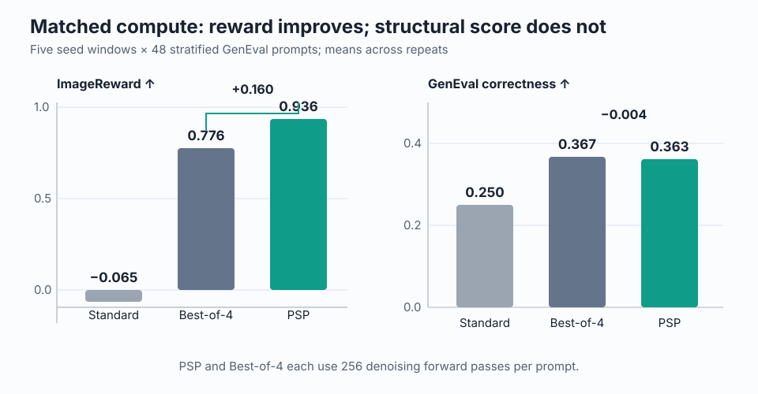
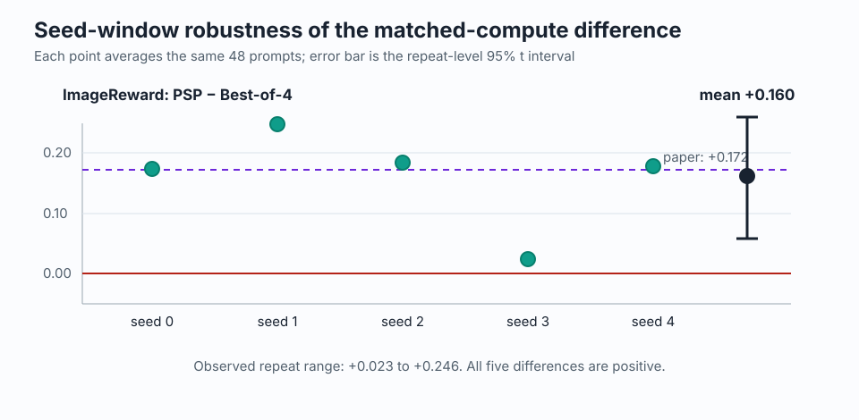
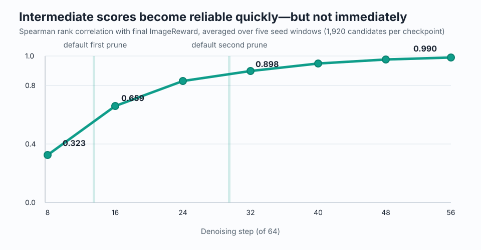
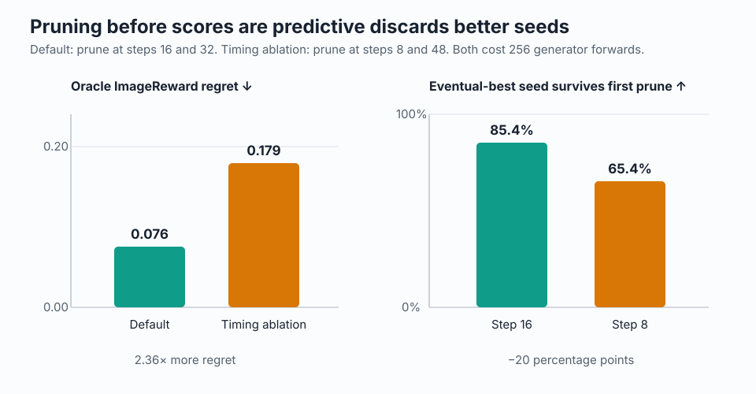

# Reproducing Progressive Seed Pruning on SD1.5

Text-to-image generators can produce very different pictures from the same prompt simply by changing the initial random noise. The paper proposes spending a fixed generation budget by trying many noise seeds briefly, scoring their early previews, and finishing only the promising ones. This reproduction tests whether that allocation beats fully generating four candidates and choosing the best.

## Verdict

**Partially reproduced.** At exactly 256 denoising forward passes per method, the released 8→4→2 schedule improved ImageReward over Best-of-4 by **+0.160** (95% repeat-level interval **+0.058 to +0.262**), close to the paper’s SD1.5 gain of **+0.172**. The gain did not clearly transfer to our independent CLIP score (**+0.0020**, interval −0.0014 to +0.0054) or bounded GenEval detector score (**−0.004**, interval −0.078 to +0.070).

Scope: five seed windows on the same 48 prompts, evenly stratified over GenEval’s six prompt types. This is 240 prompt–seed-window pairs, not the paper’s full 553-prompt evaluation.

**How to read this figure.** Higher bars are better. PSP and Best-of-4 use the same generator budget; PSP’s selection reward rises substantially, while its structural correctness is statistically indistinguishable from Best-of-4 on this subset.

## What was tested

We used the public SD1.5 checkpoint, deterministic 64-step DDIM sampling, the released PSP pipeline, and fixed ImageReward scoring. Every prompt starts from an identical pool of eight seeds:

- **Standard:** finish seed 0 (64 forwards).
- **Best-of-4:** finish the first four seeds, then select by final ImageReward (256).
- **PSP:** start eight, keep four at step 16, keep two at step 32, then select the better final image (256).
- **Timing ablation:** keep four at step 8 and two at step 48 (256).
- **Oracle-8:** fully finish all eight only to measure regret (512; diagnostic, not a matched competitor).

The harness fully denoises the common eight-seed pool once and replays selection from cached intermediate ImageReward scores. That paired offline protocol matches the paper’s main-table evaluation logic and removes generator noise between methods. The important path is implemented in [`run_reproduction.py`](../../reproduction/run_reproduction.py): generate intermediate clean-image estimates, score them, replay each pruning schedule, and evaluate the selected final images.

The original GenEval detector stack pins mmcv 1.x and is incompatible with Blackwell-era PyTorch. We retained GenEval’s object/count/color/position decision rules but used the public Transformers Mask2Former COCO checkpoint. HPSv2’s packaged tokenizer was unavailable in this environment, so independent alignment uses public CLIP ViT-B/32 cosine similarity. These are declared substitutions, not paper-equivalent metrics.

## Headline evidence

| Method | Generator forwards | ImageReward ↑ | CLIP ↑ | GenEval ↑ |
|---|---:|---:|---:|---:|
| Standard | 64 | −0.065 | 0.3178 | 0.250 |
| Best-of-4 | 256 | 0.776 | 0.3299 | **0.367** |
| PSP 8→4→2 | 256 | **0.936** | **0.3319** | 0.363 |
| Timing ablation | 256 | 0.832 | 0.3301 | 0.338 |
| Oracle-8 diagnostic | 512 | 1.012 | 0.3319 | 0.367 |

Across repeats, every ImageReward difference favored PSP. One seed window was nearly neutral, so the effect is meaningful but not automatic.

The paper reports Best-of-4 0.655 and PSP 0.827 on SD1.5, a +0.172 difference. Our absolute scores are higher because the prompt subset differs, but the paired gain is remarkably close. GenEval varies by seed window: its five paired differences were 0, 0, +0.083, −0.021, and −0.083, explaining the inconclusive average.

## Why timing matters

Intermediate ImageReward becomes more predictive of final ImageReward as denoising proceeds. Rank correlation is only 0.323 at step 8, reaches 0.659 at the default first prune (step 16), and is 0.898 at the second prune (step 32).

This directly predicts pruning regret. The default schedule preserved the eventual best-of-eight seed through its first prune 85.4% of the time and incurred 0.076 mean ImageReward regret. Pruning at step 8 preserved it only 65.4% of the time and raised regret to 0.179.

Despite identical generator budgets, default PSP beat the timing ablation by +0.104 ImageReward (repeat-level interval +0.054 to +0.154), +0.0017 CLIP, and +0.025 GenEval. Front-loaded exploration helps only when the early estimate is sufficiently informative; pruning too early throws away much of the enlarged seed pool’s value.

## Claim-by-claim assessment

| Claim | Paper | Observed | Assessment |
|---|---|---|---|
| Matched-compute PSP improves SD1.5 selection | ImageReward +0.172; HPS +0.005; GenEval +0.032 | ImageReward +0.160; CLIP +0.0020; GenEval −0.004 | **Partially aligned:** reward effect reproduced; independent and structural transfer inconclusive |
| Advantage depends on intermediate predictiveness | Later estimates become more useful; schedule matters | Spearman 0.323→0.990; early-prune regret 0.179 vs 0.076 default | **Aligned** |
| Cross-backbone generality | SD1.5, SDXL, SD3.5 | SD1.5 only | **Not attempted**; gated SD3.5 was excluded by scope |

## Compute, reproducibility, and limits

All fresh evidence ran on **OpenResearch Kubernetes** using **NVIDIA RTX PRO 6000 Blackwell** GPUs. Each formal run allocated four GPUs; four jobs overlapped for a **peak of 16 GPUs**. Five formal jobs took 119.0–121.8 seconds of measured experiment time each (602.7 seconds summed), with 28.03 GiB maximum allocated memory per GPU. The fresh run window was **0.391 wall hours** on 2026-07-26. The exact fixed command was `bash reproduction/run.sh`.

The limited prompt count gives wide intervals, the detector substitution prevents exact GenEval comparison, and offline oracle generation means measured wall time is diagnostic rather than an online PSP latency benchmark. A full reproduction still needs all 553 prompts, the original detector/HPS environments, and additional public backbones.

Code lineage: [lock-safe evaluator and seed 0](https://github.com/alphaXiv/psp-cb6b5ed0/tree/orx/lock-safe-clip-and-geneval-evaluation-scout), [seed 1](https://github.com/alphaXiv/psp-cb6b5ed0/tree/orx/lock-safe-final-evidence-seed-window-1), [seed 2](https://github.com/alphaXiv/psp-cb6b5ed0/tree/orx/lock-safe-final-evidence-seed-window-2), [seed 3](https://github.com/alphaXiv/psp-cb6b5ed0/tree/orx/lock-safe-final-evidence-seed-window-3-2), and [seed 4](https://github.com/alphaXiv/psp-cb6b5ed0/tree/orx/lock-safe-final-evidence-seed-window-4-2). Aggregated values are in [`aggregate.json`](../../results/reproduction/aggregate.json).

Open the exact public notebook at [molab.marimo.io/github/alphaXiv/psp-cb6b5ed0/blob/main/notebooks/psp_reproduction.py](https://molab.marimo.io/github/alphaXiv/psp-cb6b5ed0/blob/main/notebooks/psp_reproduction.py).
