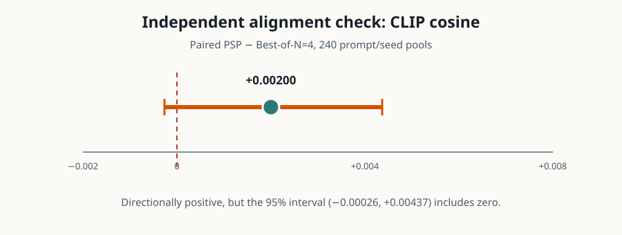
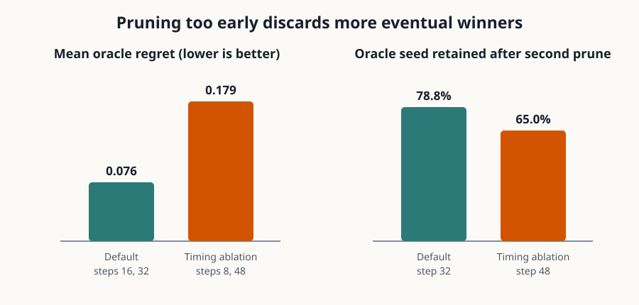

# Does progressive seed pruning spend image-generation compute better?

A text-to-image generator can produce very different pictures from the same prompt depending on its random starting noise. The paper’s idea is to try many starts cheaply, discard weak ones while images are still forming, and spend the remaining work only on promising candidates. This reproduction asks whether that strategy beats fully finishing four candidates when both approaches receive the same generation budget.

**Verdict — partially reproduced.** Progressive seed pruning (PSP) delivered a clear ImageReward gain close to the paper’s result, and the timing ablation supported the proposed mechanism. The bounded GenEval detector result did not show the paper’s gain, while the independent CLIP result was positive but inconclusive.

**Scope.** Five fresh seed windows produced 240 paired candidate pools on a stratified 48-prompt GenEval subset with Stable Diffusion 1.5. Runs used Kubernetes on NVIDIA RTX PRO 6000 Blackwell GPUs, four GPUs per run and 16 at peak concurrency; the fresh attempt spanned **0.391 elapsed wall-hours**.

Read each panel as PSP minus matched-compute Best-of-N=4. The ImageReward gain was **+0.160** (95% paired prompt bootstrap **+0.092 to +0.232**), close to the paper’s +0.172. GenEval instead changed by **−0.004** (−0.042 to +0.033), versus the paper’s +0.032; this subset therefore provides no evidence of a detector gain.

## What was compared

Every prompt used the same eight initial seeds. We cached all 64-step trajectories, then replayed selection rules so image generation was paired exactly:

- **Best-of-N=4:** fully denoise four seeds, then choose the highest final ImageReward: 4×64 = 256 denoising passes.
- **PSP default:** start eight, retain four at step 16, retain two at step 32, then finish: 8×16 + 4×16 + 2×32 = 256 passes.
- **Timing ablation:** retain four at step 8 and two at step 48: 8×8 + 4×40 + 2×16 = 256 passes.
- Standard sampling used 64 passes. Fully finishing all eight seeds used 512 passes only to measure oracle regret, not as a matched baseline.

The harness follows the released SD1.5 code path and fixed ImageReward guidance. HPSv2 assets were unavailable, so the independent check is CLIP ViT-B/32 cosine. GenEval’s original mmcv 1.x stack was incompatible with this environment; we kept its decision rules but used the public Transformers Mask2Former detector. These substitutions limit metric comparability.

## Claim-by-claim evidence

| Claim | Paper | Observed | Assessment | Compute |
|---|---:|---:|---|---|
| PSP beats Best-of-N=4 in ImageReward | +0.172 | +0.160 [0.092, 0.232] | Aligned | 5×4-GPU Kubernetes runs |
| PSP beats Best-of-N=4 in GenEval | +0.032 | −0.004 [−0.042, 0.033] | Divergent under this bounded detector setup | Same paired runs |
| Independent alignment improves | HPS +0.005 | CLIP +0.0020 [−0.0003, 0.0044] | Inconclusive; metric substituted | Same paired runs |
| Early estimates predict final reward; timing matters | Qualitative schedule ablations | Correlation 0.323→0.990; regret 0.076 vs 0.179 | Aligned | Same trajectories |

Mean terminal job time was 120.7 seconds after environment setup and model caching within each Kubernetes job. Peak allocated memory was 28.03 GiB per GPU (29.81 GiB reserved).

The independent metric moved in the same direction as ImageReward, but its interval crosses zero. This split is consistent with reward selection bias: selecting with ImageReward guarantees pressure on that score, not on every notion of prompt alignment.

## Why pruning time matters

At step 8, the ranking of seeds by intermediate ImageReward had only 0.323 mean Spearman correlation with the final ranking. It reached 0.659 by step 16 and 0.898 by step 32. Front-loaded exploration helps only if pruning waits long enough for the intermediate estimate to become informative.

The default schedule’s mean regret against the best of all eight completed seeds was 0.076 ImageReward. Moving the first cut to step 8 and the second to step 48 raised regret to 0.179 and reduced eventual-best-seed survival after the second cut from 78.8% to 65.0%. Despite identical budgets, the timing ablation also scored 0.104 ImageReward below default PSP.

## Interpretation and limits

The selected headline reward claim transfers cleanly at small scale: the observed +0.160 is close to +0.172 and statistically separated from zero. The broader prompt-alignment claim does not transfer across metrics here. With only 48 unique prompts and a detector-stack substitution, the GenEval estimate is too uncertain to establish a modest +0.032 effect; its point estimate is slightly negative.

This reproduction covers SD1.5 only, not the paper’s SDXL or gated SD3.5 backbones, and cannot establish cross-backbone generality. A full reproduction would run all 553 GenEval prompts with the original detector and HPSv2 assets, retain multiple seed windows, and repeat the paired analysis for the public SDXL checkpoint.

[Self-contained marimo notebook](../../notebooks/psp_reproduction.py) · [Aggregate JSON](../../results/reproduction_summary.json) · [Paper](https://arxiv.org/abs/2607.21591)

